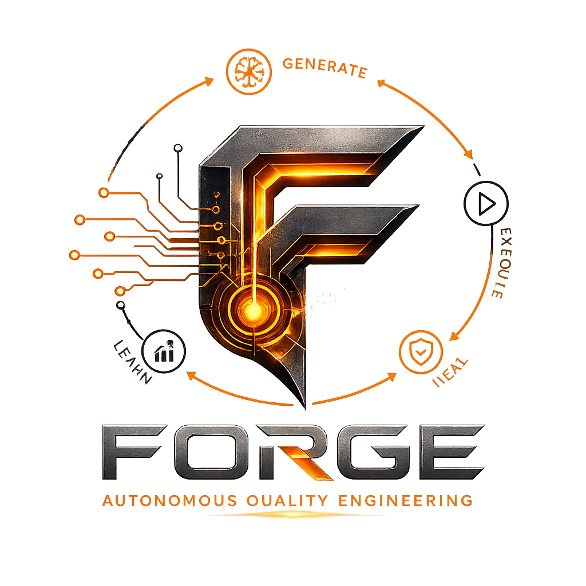
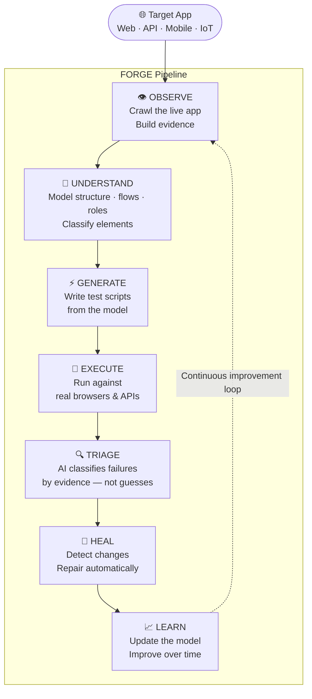
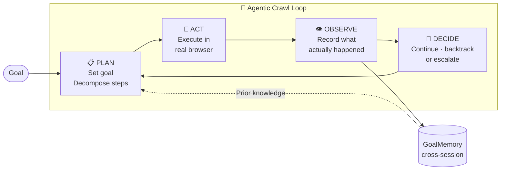
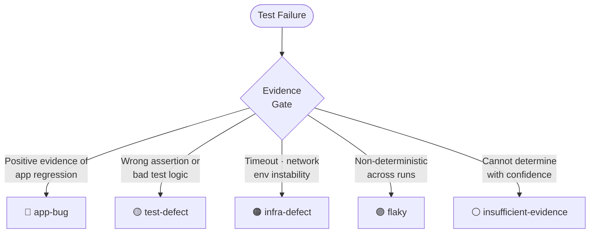

<div align="center">



# FORGE
### AI-Augmented Quality Engineering Platform

[](https://github.com/rkasthuri/forge-framework/actions)
[](https://nodejs.org)
[](https://playwright.dev)
[](https://anthropic.com)
[](LICENSE)

</div>

---

## What FORGE Is

FORGE is an AI-augmented Quality Engineering platform and applied research project focused on building reliable, evidence-driven software testing.

Rather than treating AI as a code generator, FORGE applies AI throughout the testing lifecycle — application understanding, test generation, execution, triage, healing, and continuous learning — while grounding every decision in observable evidence.

The project serves as both an engineering platform and an experimental environment for advancing trustworthy, explainable AI-assisted Quality Engineering.

> *"This isn't just another Playwright framework. It's a question about how to build AI that earns its confidence rather than assumes it."*

---

## Why FORGE Exists

Traditional automation frameworks generate scripts. FORGE is built around a different philosophy:

| Principle | What It Means in Practice |
|---|---|
| **Observe before Assert** | FORGE crawls and witnesses app behaviour before making any claim about it |
| **Evidence before Confidence** | Confidence scores are derived from what was actually observed — never assumed |
| **Never Invent Specificity** | If FORGE can't verify something, it says so — it never fabricates a confident answer |
| **AI must be Explainable** | Every AI decision carries a reason, not just a result |
| **Every Capability needs an Eval** | No AI feature ships without a measurable evaluation harness |
| **Learn from Production, not Assumptions** | The app model updates from real observed behaviour, not static documentation |

These aren't slogans — they are reflected in the Architecture Decision Records (ADRs) and enforced throughout the codebase.

---

## Vision



---

## Current Capabilities

> Honesty is a design principle here too — shipped is shipped, planned is planned.

| Capability | Status | Notes |
|---|---|---|
| Application Crawling (UI) | ✅ Shipped | BFS, SPA, Hybrid — auto-detected |
| Application Crawling (API) | ✅ Shipped | REST API + GraphQL |
| App Model Generation | ✅ Shipped | Pages, elements, flows, roles, confidence |
| AI Element Classification | ✅ Shipped | Names elements by meaning, not DOM label |
| AI Flow Detection | ✅ Shipped | Identifies user journeys automatically |
| AI Test Generation | ✅ Shipped | Produces runnable Playwright specs |
| AI Failure Triage | ✅ Shipped | 5-category evidence-gated classification |
| Evidence-driven Healing | ✅ Shipped | Selector repair with confidence safeguards |
| Flaky Test Prediction | ✅ Shipped | Risk-scored from historical run data |
| Evaluation Harnesses | ✅ Shipped | Measurable evals for triage, generation, healing |
| Agentic Crawl Planner | 🔄 In progress | Goal-directed, stateful exploration |
| Bootstrap Mode | 🔄 In progress | Auto-config from URL — no manual setup |
| Cross-session Goal Memory | 🔄 In progress | Agent learns across runs, not just within them |
| Dashboard | 🗓️ Planned | After pipeline is fully stable |
| Mobile Testing | 🗓️ Planned | Same pipeline, different surface |
| IoT Testing | 🗓️ Planned | Future direction |

---

## Architecture

```mermaid
graph TD
    subgraph INPUT ["Input Layer"]
        A1[Web App / SPA]
        A2[REST API / Microservices]
        A3[Mobile · IoT — planned]
    end

    subgraph CRAWL ["Phase 1 — Crawl"]
        B1[BFSStrategy]
        B2[SPAStrategy]
        B3[HybridStrategy]
        B4[AuthManager]
        B5[ApiSpecCrawler]
        B6[StrategyDetector — auto]
    end

    subgraph MODEL ["Phase 2 — Model"]
        C1[ElementClassifier]
        C2[FlowDetector]
        C3[ModelValidator]
        C4[SQLite AppModel DB]
    end

    subgraph VERIFY ["Phase 3 — Verify"]
        D1[VerificationRunner]
        D2[SelfCorrectionEngine]
        D3[Evidence Tier Scoring]
        D4[InputHealth Gate]
    end

    subgraph GENERATE ["Phase 4 — Generate"]
        E1[TestGenerator]
        E2[PomGenerator]
        E3[SpecGenerator]
        E4[FixtureGenerator]
    end

    subgraph EXECUTE ["Phase 5 — Execute"]
        F1[Playwright Runner]
        F2[CI / GitHub Actions]
        F3[Run History Store]
    end

    subgraph TRIAGE ["Phase 6 — Triage"]
        G1[AI Triage Engine]
        G2[5-Category Classifier]
        G3[FlakyPredictor]
        G4[HealConfidence Scoring]
    end

    subgraph HEAL ["Phase 7 — Heal"]
        H1[SmartLocator]
        H2[HealStore]
        H3[VisionHealer]
        H4[AdaptiveFixes]
    end

    subgraph LEARN ["Phase 8 — Learn"]
        I1[Trend Analysis]
        I2[Coverage Gap Engine]
        I3[Release Notes Generator]
        I4[GoalMemory — in progress]
    end

    subgraph AI ["🤖 AI Layer — Claude API"]
        J1[Element Naming]
        J2[Flow Detection]
        J3[Failure Triage]
        J4[Evidence Grounding]
        J5[Agentic Planner — in progress]
    end

    INPUT --> CRAWL --> MODEL --> VERIFY --> GENERATE --> EXECUTE --> TRIAGE --> HEAL --> LEARN
    LEARN -.->|Model update loop| MODEL
    AI --- MODEL
    AI --- VERIFY
    AI --- TRIAGE
    AI --- HEAL
```



---

## Where AI Changes the Game

Traditional automation still relies heavily on people to notice change, diagnose it, and manually update scripts. The table below shows where AI closes that gap — and where human judgment still leads.

| QE Activity | Traditional Automation | FORGE — AI-Augmented |
|---|---|---|
| **Mapping the application** | SDET manually explores and documents pages/flows | FORGE crawls the live app and builds the map automatically |
| **Deciding what to test** | Human judgment per app, per sprint | AI applies consistent rules at scale — no fatigue, no bias |
| **Writing test scripts** | Hand-coded, line by line, for every flow | Generated directly from the observed app model |
| **Maintaining tests when the app changes** | Find the failure → hunt the script → understand the change → fix manually | FORGE detects the change, diagnoses the cause, updates the test automatically |
| **Diagnosing failures** | A red X — someone digs through logs to determine if it's a real bug | AI classifies root cause before a human looks at it |
| **Selector stability — self-healing** | Broken element ID = broken test, until someone fixes it | FORGE re-locates the element and updates the test, with safeguards against false heals |
| **API contract changes** | Generic failure → manual trace-back to what changed | Contract drift detected — affected tests updated |
| **Trust in results** | Pass/fail with no nuance — a pass can hide a weak check | Every result is evidence-tagged: how it was verified, and how confident FORGE is |
| **Scaling to new applications** | Custom automation logic per app | Zero app-specific hardcoding — the same pipeline runs any web app |

> **What AI does not change:** Business risk priorities, edge case judgment, and what "correct" means for a given feature. Those remain human decisions. FORGE is designed to make that judgment easier, not to replace it.

---

## Agentic Capabilities — What's Being Built

FORGE is moving beyond scripted pipeline steps toward AI agents that can plan, act, observe, and decide autonomously.



| Agentic Capability | Status | Design Principle |
|---|---|---|
| **Goal-directed crawl** | 🔄 In progress | Agent sets a goal (e.g. "reach checkout") and plans the steps to get there — rather than blindly following links |
| **Prerequisite execution** | 🔄 In progress | Agent performs required steps (add to cart, login) before verifying stateful pages — evidence is genuinely observed, not assumed |
| **Cross-session GoalMemory** | 🔄 In progress | Agent remembers what it learned across runs — doesn't re-explore proven paths |
| **Supervised / Autonomous mode** | 🔄 In progress | CLI flag (`--supervised` / `--autonomous`) controls how much the agent acts without confirmation — default is supervised for safety |
| **Confidence decay** | 🗓️ Planned | Older observations lose confidence over time — forces re-verification rather than trusting stale models |
| **Bootstrap Mode** | 🔄 In progress | Point FORGE at any URL — it auto-detects app type, auth, and crawl strategy, generates the config, and begins crawling |

> **Core constraint:** Agentic exploration must make evidence real by observing it. The agent is never permitted to synthesize or infer paths it has not actually navigated — that would violate the foundational evidence principle.

---

## AI Failure Triage — Evidence Gate

Every test failure is classified by AI before a human looks at it. The classification cannot exceed the quality of available evidence.



**Validation results against live apps:**
- **0% false app-bug rate** — the evidence gate prevents AI from guessing
- **97.4% triage accuracy** on evaluation harness
- `insufficient-evidence` is a first-class outcome — not a fallback, not an error

---

## Engineering Philosophy

These principles are not aspirational — they are enforced in the architecture and documented in the ADRs.

```
Observe before Assert.
────────────────────────────────────────────────
Every claim FORGE makes must be earned from real observation.
Inference without evidence is not permitted.

Evidence before Confidence.
────────────────────────────────────────────────
Confidence scores are derived — never assumed.
A healing action can never be more confident
than the evidence it was built on.

Never Invent Specificity.
────────────────────────────────────────────────
ADR-011: The generator must not assert things
it cannot verify. "I don't know" is a valid,
correct, and sometimes the only honest answer.

AI must be Explainable.
────────────────────────────────────────────────
Every triage decision carries a reason.
Every heal carries a confidence tier.
No silent decisions.

Every Capability needs an Eval.
────────────────────────────────────────────────
No AI feature is considered shipped until
it has a measurable evaluation harness
with a ground-truth dataset and a pass threshold.

Learn from Production, not Assumptions.
────────────────────────────────────────────────
The app model is updated from real observed
behaviour. Static documentation, guesses,
and stale models are not trusted sources.
```

---

## Evaluation Harnesses

FORGE validates its own AI capabilities with measurable, reproducible evals — not manual spot-checks.

| Eval | What It Measures | Result |
|---|---|---|
| **Triage eval** | Accuracy of 5-category failure classification | 97.4% accuracy · 0% false app-bug rate |
| **Generation eval** | Behavioural correctness of generated test specs | 100% pass rate · 6/6 SauceDemo specs |
| **Healing eval** | Correctness of automated selector repair | 100% correct heal rate on validation set |

> These numbers are earned, not claimed. Each eval has a ground-truth dataset, a runner, and a reporter — all in `/evals`.

---

## Live Test Targets

FORGE is validated against three structurally different real applications — not a single toy example.

| App | Type | What FORGE Tests |
|---|---|---|
| [SauceDemo](https://www.saucedemo.com) | Traditional multi-page UI | Auth flows, product listing, cart, checkout, role-based access |
| [OrangeHRM](https://opensource-demo.orangehrmlive.com) | Complex SPA | Employee management, deep navigation, multi-role access |
| [Restful Booker](https://restful-booker.herokuapp.com) | REST API | Endpoint discovery, CRUD, contract validation, drift detection |

---

## Tech Stack

| Layer | Technology | Role |
|---|---|---|
| Browser Automation | **Playwright + TypeScript** | Drives real browsers · navigates · reads DOM |
| AI Reasoning | **Claude API (Sonnet)** | Classifies · generates · triages · explains |
| Runtime | **Node.js 24** | Orchestrates the full pipeline |
| Data Store | **SQLite** | App model · test history · healing records |
| CI/CD | **GitHub Actions** | Automated pipeline on every push |
| Local AI (optional) | **Ollama (CPU)** | Candidate for lower-stakes tiered routing |

---

## Project Status

| Dimension | Status |
|---|---|
| Current phase | AI-Augmented Automation Platform |
| Current focus | Agentic Crawl Architecture + Bootstrap Mode |
| Repository | Active research & development |
| Validation | Live against 3 structurally different real apps |

---

## Research Areas

- AI Test Generation from observed app models
- Evidence-based confidence scoring
- Autonomous failure analysis and classification
- Agentic Quality Engineering — plan · act · observe · decide
- Evaluation harnesses for AI capabilities in QE
- Application modeling across UI, API, and future surfaces
- Self-healing automation with integrity safeguards
- Cross-session learning and goal memory for test agents

---

## Repository Structure

```
forge-framework/
├── src/
│   ├── core/
│   │   ├── onboarding/      # Crawlers, StrategyDetector, AuthManager
│   │   ├── healing/         # HealStore, SmartLocator, VisionHealer
│   │   ├── triage/          # 5-category taxonomy, confidence scoring
│   │   ├── storage/         # SQLite DB, repositories, migrations
│   │   └── ai/              # Claude API client, budget tracker
│   ├── apps/                # Per-app configs and generated test suites
│   ├── pipeline/            # Triage, fixes, impact, trends, coverage
│   └── platform/            # Dashboard and query servers
├── evals/                   # Evaluation harnesses and ground-truth datasets
├── models/                  # Generated app models (per app)
├── docs/                    # ADRs, TECH_DEBT.md, ARCHITECTURE_NORTH_STAR.md
├── scripts/                 # Proof tests and utilities
└── .github/workflows/       # CI pipeline
```

---

## Roadmap

| Milestone | Status |
|---|---|
| ✅ AI Failure Triage | Shipped |
| ✅ Evidence-based Test Generation | Shipped |
| ✅ Honest Self-Healing | Shipped |
| ✅ Evaluation Harnesses | Shipped |
| 🔄 Agentic Crawl Planner | In progress |
| 🔄 Bootstrap Mode | In progress |
| 🔄 Cross-session Goal Memory | In progress |
| 🗓️ Learning Loops | Planned |
| 🗓️ Dashboard | Planned — after pipeline is stable |
| 🗓️ Autonomous QE Platform | Long-term direction |

---

## Getting Started

```bash
git clone https://github.com/rkasthuri/forge-framework.git
cd forge-framework
npm install
npx playwright install chromium
cp .env.example .env   # Add ANTHROPIC_API_KEY and app credentials
```

```bash
# Onboard a new application
npm run onboard -- --app=saucedemo
npm run onboard:verify -- --app=saucedemo
npm run onboard:generate -- --app=saucedemo

# Run tests
npm run test:all

# Triage failures
npm run triage:verbose

# Self-heal broken tests
npm run fixes
```

See the [CLI Glossary](docs/CLI-GLOSSARY.md) for the full command reference.

---

## About

Developed by **Raj Kasthuri** as part of an independent Quality Engineering consulting and applied AI R&D initiative focused on advancing trustworthy, evidence-driven AI-assisted software testing.

[](https://www.linkedin.com/in/rajkasthuri)
[](https://github.com/rkasthuri/forge-framework)

---

<div align="center">

*FORGE — Observe. Understand. Generate. Execute. Triage. Heal. Learn.*

</div>
